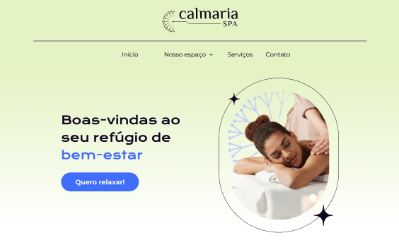

# Calmaria Spa

An application for manipulating interactive elements such as menus with submenus, modals and accordions with a focus on accessibility.

## 🔨 Project features

The App is a page where until now all elements are visual only. It has a navigation menu with submenu, a modal to sign up and get a discount, a modal to get in touch and an accordion with the most frequently asked questions, all of these elements will be interactive using JavaScript.

## ✔️ Techniques and technologies used

During this course we will use:

- `Figma`
- `JavaScript`
- `HTLM`
- `CSS`

## 📁 Figma Link

You can [access the project figma here](https://www.figma.com/file/1pDTUXo7ovT6zlE64Zw509/Calmaria-Spa--%7C-Forma%C3%A7%C3%A3o-Acessabilidade?type=design&node-id =1289%3A1086&mode=dev).

## 🛠️ Open and run the project

You can open an `index.html` page using VSCode with the `Live Server` extension for automatic viewing and updating, or open the `index.html` file directly in the browser and manually update after changes. Both methods display the page in the browser.